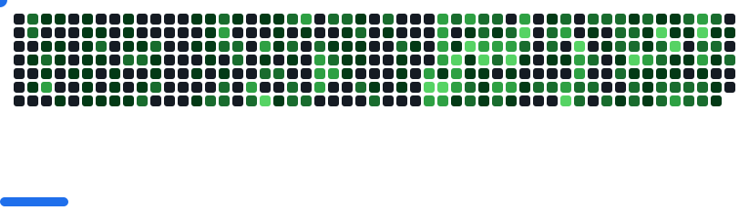

<h1 align="center">
    
</h1>

<h3 align="center">A passionate AI Engineer & Game Developer from Bangladesh .</h3>

 

 
 🔭 Serving as a ***Junior AI Engineer*** at Softvence Delta | A Betopia group, contributing to AI-driven solutions and projects
 
 🌱 I’m currently learning ** Gen AI, Machine learning, Langchain, Rag-Based Applications, Unreal Engine, Unity, GAS, RPG,**

💬 Ask me about **ML, DL, Gameplay Programming, C++, Blueprint... or anything [here](https://github.com/NayeemHossenJim/NayeemHossenJim/issues)**

⚡ Fun fact **In RDR2 Arthur Could servive if he drink Nigel West Dickens Elixir !!**
 
 

 

 
  
  
  

 

 
<h2 align="center">⚒️ Languages-Frameworks-Tools ⚒️</h2>
 

    
    
     
     

 

<h2 align="center">🔵 Github Contribution 🔵</h2>
<picture>
  <source
    media="(prefers-color-scheme: light)"
    srcset="images/breakout-light.svg"
  />
  
</picture>

<h2 align="center">⚡ Stats ⚡</h2>
 

  
 

 
  

 

 
