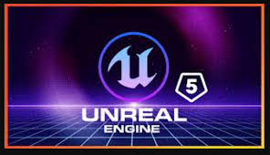
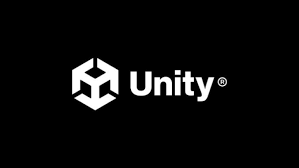
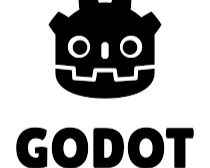
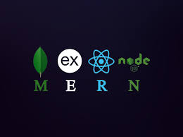
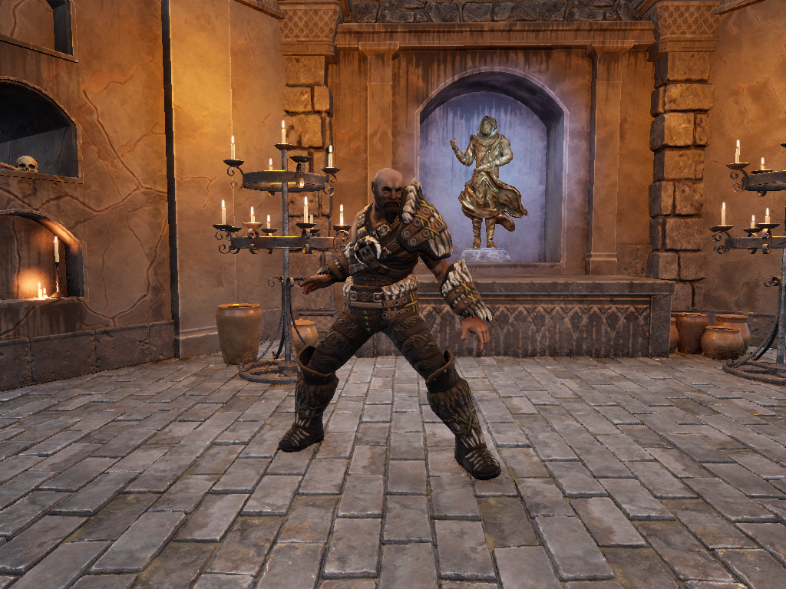
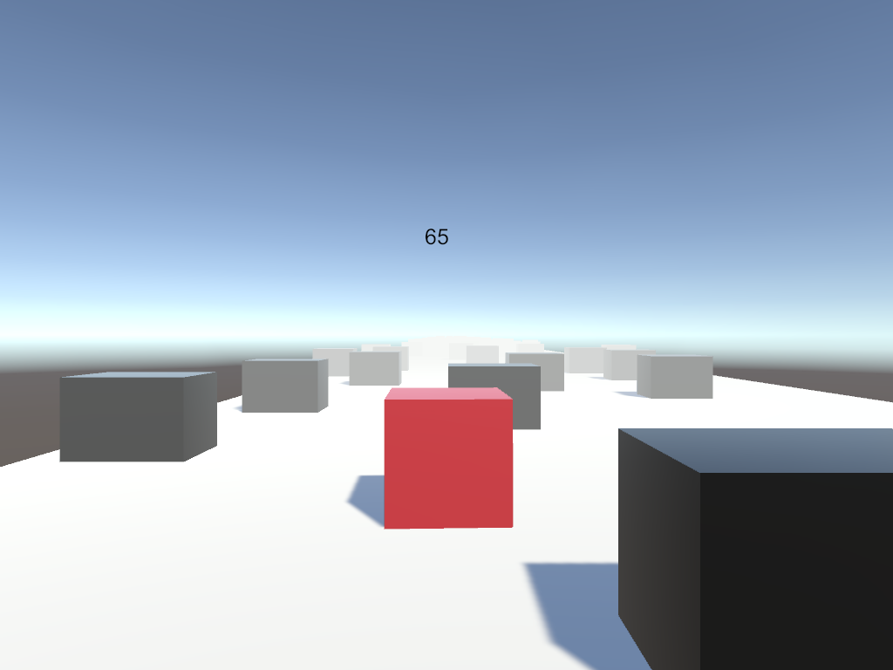

- 👋 Hi, I’m @Nayeem_Hossen_Jim 👨‍💻.

- 🔰 I’m interested in Game Developement & Web Developement.

- 📖 I’m currently learning Unreal Engine 5 , Unity , GODOT , & MERN Stack.

- 📷  Here are some screenshot during my Game Dev Projects .

- 💞️ I’m looking to collaborate on it .

- 😄 Pronouns: He/Him

